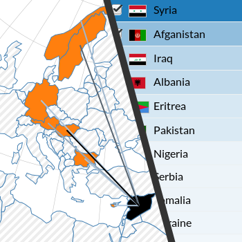

# Refugees Statistics

 

### How to run?

To run the project create a local server, for example with python:
```
python -m http.server 8888
```
or
```
python -m SimpleHTTPServer 8888
```
Afterwards, just navigate to the main folder to run the index.html file.

The project was tested in a recent version (December 2015) of Google Chrome.
